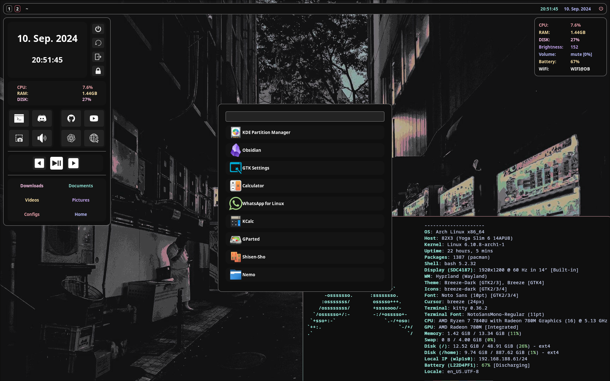

## About
My current Arch setup using: `Hyprland + AGS + Swaylock (effects)`.
The Text editor is: `Neovim + Zathura (.pdf)`.

## How to install
`git clone https://github.com/OfflineBot/my_dotfiles.git`

Setup config files (can be done later): 
`pacman -S stow`
Copy the foldercontent of my_dotfiles to `~/dotfiles` and enter `stow .` to set everything up.

Now install all packages:
`cd my_dotfiles
./install.sh`

## Packages
`aylurs-gtk-shell, baobab, base, base-devel, breeze, breeze-gtk, breeze-icons, breeze-plymouth, brightnessctl, btop, clang, cmake, discord, firefox, fzf, gcc, gdb, git, grim, hyprland, kitty, mkinitcpio, nemo, neovim, obsidian, npm, pavucontrol, pipewire, pyright, python, rust, rust-analyzer, sddm, slurp, stow, swaylock-effects, swww, texlive-basic, texlive-bin, texlive-binextra, texlive-latex, texlive-latexextra, texlive-latexrecommended, unzip, valgrind, visual-studio-code-bin, zathura, zathura-pdf-poppler, wl-clipboard`
Hope those are all!

## Usaged for
This is the Laptop version so no gpu drivers (bc i dont need them, maybe change this later).
Used for school (vimtex + zathura) and some coding

